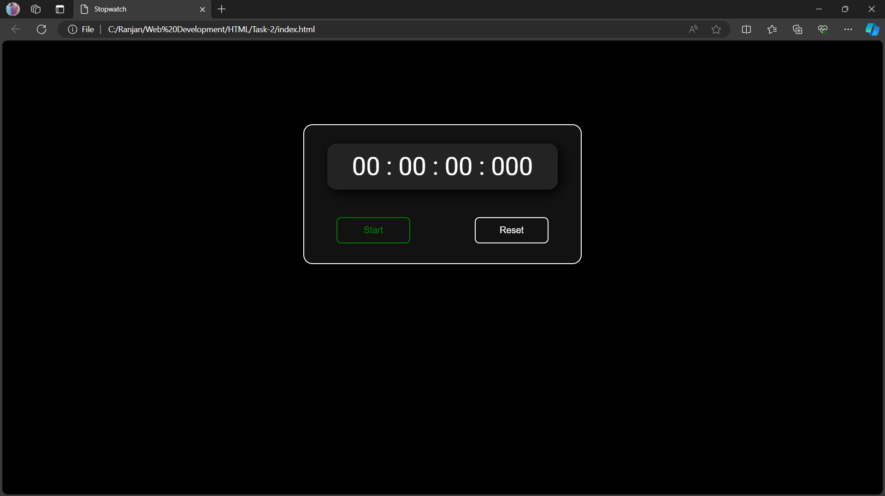
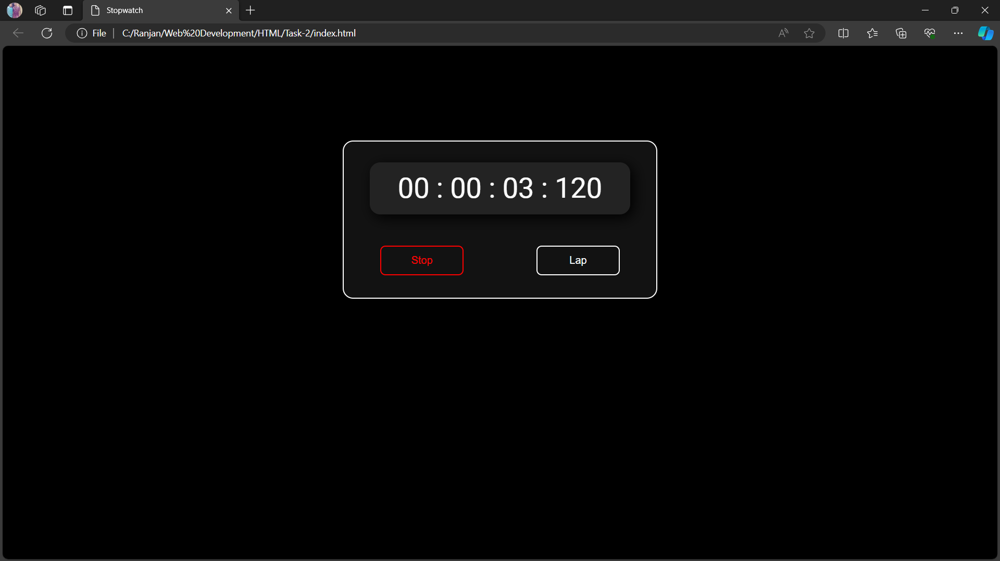
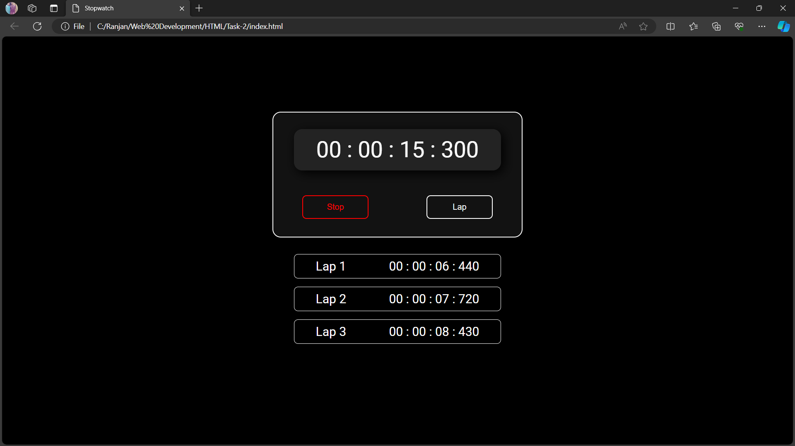

<h1>PRODIGY_WD_2</h1>

This is task 2 of my Web Development internship at Prodigy InfoTech. In this task I have to develop a stopwatch web application. In this stopwatch web app, I have included four different options like start, stop, lap and reset. With these four options we can start the timer and for recording the laps we can use the lap option and to stop the timer and clear the recorded laps and time duration we can use the stop and reset options respectively. 

<h2>Samples</h2>

<h2>Technologies Used</h2>
<ul>
  <li>HTML</li>
  <li>CSS</li>
  <li>JAVASCRIPT</li>
</ul>
<h2>Contribute</h2>

I am always curious to know how better can we make one thing. So, feel free to make contributions. If you have ideas for improvements or new features, feel free to open an issue or submit a pull request.

